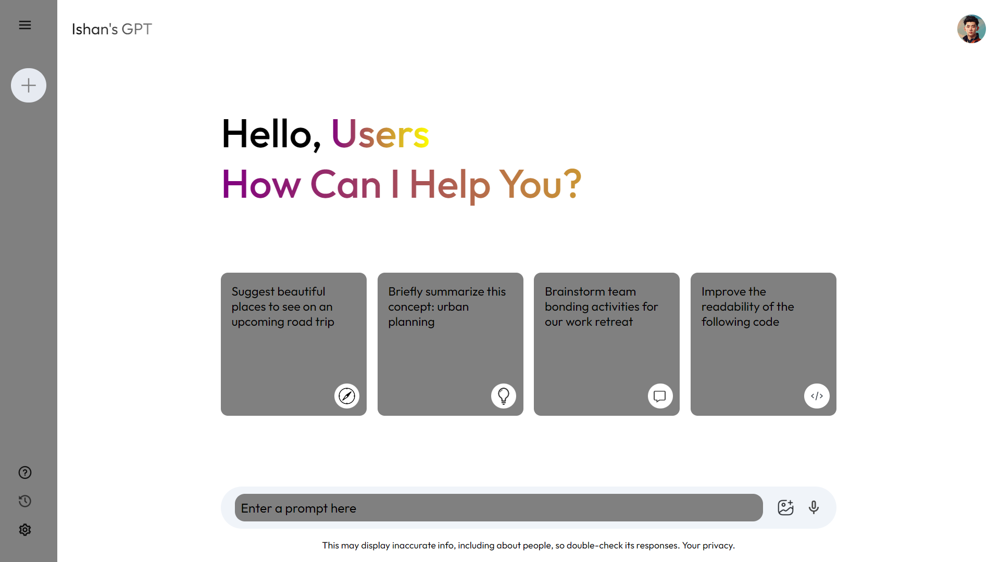
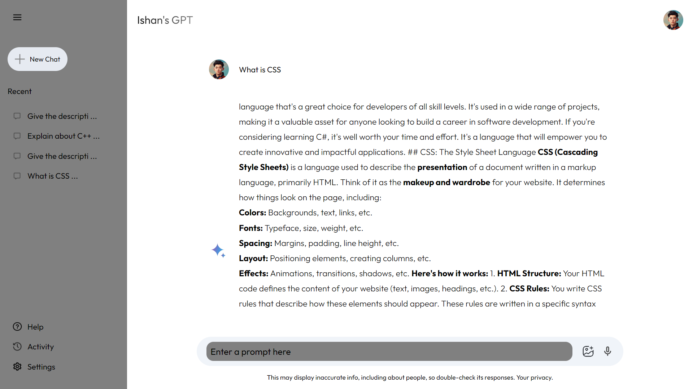
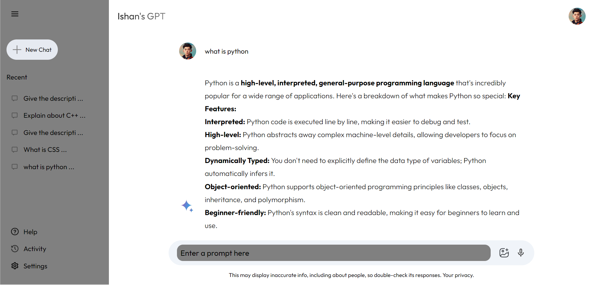

<h1>Google Gemini Clone</h1>

This project replicates the core functionality of a chat application, focusing on user interaction through a clean and intuitive interface.

This repository contains a clone of Google Gemini, developed as a learning project to enhance my skills in web development. The clone includes:

<li>Responsive design for various screen sizes.</li>
<li>Built with HTML, CSS, JavaScript, and React.js</li>
<li>Used of IMDB Movies API and Youtube API</li>
<li>Basics Login Page</li>
<li>Create Multiple Pages using react router dom</li>

#

Home Screen

#

Prompt Screen

#

